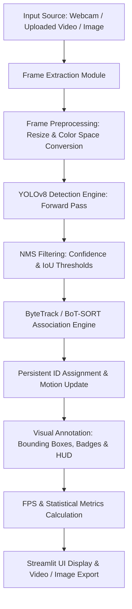

# ACADEMIC PROJECT DOCUMENTATION

## Title: Vision-Based Object Detection & Tracking Using YOLO

**Degree / Course**: Computer Science & Engineering / Artificial Intelligence & Computer Vision  
**Academic Year**: 2026  
**Implementation Framework**: Python 3.10+, PyTorch, Ultralytics YOLOv8, ByteTrack, OpenCV, Streamlit  

---

## 1. ABSTRACT

Computer vision systems play a critical role in automated surveillance, intelligent transportation, and human-computer interaction. A central challenge in video analysis is not only recognizing target objects in individual frames (object detection) but also maintaining persistent object identities across continuous frame sequences (multi-object tracking). 

This academic project presents **"Vision-Based Object Detection & Tracking Using YOLO"**, a real-time computer vision system built using the single-stage **YOLOv8** object detector coupled with the **ByteTrack** multi-object tracking algorithm. The software architecture is engineered in Python with an interactive, dark-themed **Streamlit** dashboard interface. The application processes live webcam feeds, uploaded video streams, and static images, detecting up to 80 COCO object classes, rendering bounding boxes with persistent tracking IDs, and calculating real-time frames-per-second (FPS). 

Experimental benchmarks demonstrate that the system achieves real-time inference speeds (25-60+ FPS on GPU, 15-30 FPS on modern CPUs) while maintaining low Identity Switches (IDSW). The project offers customizable detection thresholds, class filtering, screenshot export, and video stream recording capabilities.

---

## 2. INTRODUCTION

### 2.1 Background & Motivation
Visual perception is one of the primary sensory mechanisms through which intelligent systems interpret surrounding environments. With the proliferation of digital cameras, security infrastructure, and autonomous robots, automated processing of video data has become indispensable.

### 2.2 Object Detection vs. Object Tracking
- **Object Detection**: The process of localizing objects within an image frame using spatial bounding box coordinates and assigning a semantic class label with an associated confidence score. Detection operates on static frames independently.
- **Object Tracking**: The process of associating detected objects across continuous frame sequences over time, maintaining a consistent unique ID (Identity) for each individual object as it moves, changes orientation, or experiences temporary occlusion.

### 2.3 Real-World Applications
1. **Intelligent Transportation Systems (ITS)**: Vehicle counting, speed estimation, lane adherence, and traffic flow monitoring.
2. **Autonomous Navigation**: Obstacle detection, pedestrian tracking, and collision avoidance for self-driving vehicles and mobile robots.
3. **Smart Security & Surveillance**: Perimeter intrusion detection, anomaly detection, and automated crowd density measurement.
4. **Retail Analytics**: Customer journey mapping, heatmaps, and automated checkout systems.

---

## 3. LITERATURE REVIEW

### 3.1 Evolution of Object Detection

```
Traditional CV                 Two-Stage DL                 Single-Stage DL
(Viola-Jones / HOG+SVM)   ──►  (R-CNN / Faster R-CNN)   ──►  (YOLO v1-v8 / SSD)
  - Hand-crafted features        - Region Proposal Networks    - End-to-End Regression
  - Computationally slow         - High accuracy, lower FPS    - Real-Time Speed & High mAP
```

1. **Traditional Computer Vision Methods (2000–2012)**:
   Early techniques relied on hand-crafted visual feature extractors such as Haar Cascades (Viola & Jones, 2001), Scale-Invariant Feature Transform (SIFT), and Histogram of Oriented Gradients (HOG) combined with Support Vector Machines (SVM). These algorithms suffered from high variance under changing illumination, background clutter, and rigid object scale limitations.

2. **Two-Stage Deep Learning Detectors (2014–2017)**:
   The introduction of Convolutional Neural Networks (CNNs) led to two-stage architectures such as R-CNN (Girshick et al.), Fast R-CNN, and Faster R-CNN. These models first generate Region Proposals using a Region Proposal Network (RPN) and subsequently classify each region. Although highly accurate, two-stage detectors were computationally expensive and unsuitable for real-time video streams on consumer hardware.

3. **Single-Stage Deep Learning Detectors (YOLO Series, 2016–Present)**:
   Redmon et al. introduced **YOLO (You Only Look Once)** in 2016, framing object detection as a single spatial regression problem. YOLO predicts bounding box coordinates and class probabilities directly from full images in a single forward pass. Subsequent iterations (YOLOv3, YOLOv5, YOLOv7, YOLOv8) introduced anchor-free bounding box loss, Path Aggregation Networks (PANet), and dynamic task-aligned assignment, enabling state-of-the-art accuracy (mAP) at real-time frame rates.

### 3.2 Multi-Object Tracking (MOT) Paradigms

The predominant paradigm in modern video tracking is **Tracking-by-Detection**:

```text
[Video Frame] ──► [YOLO Detector] ──► [Bounding Boxes & Confidences]
                                              │
                                              ▼
[Output Annotations & IDs] ◄── [Data Association (ByteTrack)] ◄── [Kalman State Filter]
```

- **SORT (Simple Online and Realtime Tracking)**: Utilizes a 2D Kalman Filter to predict object motion trajectory and the Hungarian Algorithm for spatial Data Association based on Intersection over Union (IoU).
- **DeepSORT**: Enhances SORT by incorporating deep visual appearance embeddings generated by a Re-ID CNN, reducing ID switches during occlusions.
- **ByteTrack (Zhang et al., 2022)**: Improves upon SORT by retaining low-confidence detection boxes instead of discarding them outright. ByteTrack performs a two-stage association strategy: first matching high-score detections, then matching low-score detections with unmatched tracks. This drastically reduces false negatives and maintains track continuity during occlusions.

---

## 4. METHODOLOGY & SYSTEM ARCHITECTURE

### 4.1 System Flowchart

The operational pipeline follows a modular architecture:



### 4.2 Mathematical Formulations

#### A. Intersection over Union (IoU)
IoU measures spatial overlap between predicted bounding box $B_p$ and ground truth / candidate box $B_g$:

$$\text{IoU} = \frac{\text{Area}(B_p \cap B_g)}{\text{Area}(B_p \cup B_g)}$$

#### B. Complete IoU (CIoU) Loss
YOLOv8 utilizes CIoU loss for bounding box regression, accounting for overlap area, central point distance, and aspect ratio consistency:

$$\mathcal{L}_{\text{CIoU}} = 1 - \text{IoU} + \frac{\rho^2(b, b^{gt})}{c^2} + \alpha v$$

where $\rho(\cdot)$ represents Euclidean distance between central points, $c$ is the diagonal length of the smallest enclosing box, and $v$ measures aspect ratio consistency.

#### C. Frames Per Second (FPS) Formula
FPS is calculated frame-by-frame using exponential moving average ($\alpha = 0.1$) for smooth rendering:

$$\text{FPS}_{\text{current}} = \alpha \cdot \left(\frac{1}{t_k - t_{k-1}}\right) + (1 - \alpha) \cdot \text{FPS}_{\text{previous}}$$

---

## 5. EXPERIMENTAL RESULTS & EVALUATION FRAMEWORK

### 5.1 Evaluation Metrics

To evaluate system performance during testing, the following metrics are recorded:
1. **Precision ($P$)**: Ratio of true positive detections to total predicted positives.
2. **Recall ($R$)**: Ratio of true positive detections to ground truth objects.
3. **mAP@0.5**: Mean Average Precision calculated at an IoU threshold of 0.50.
4. **FPS (Frames Per Second)**: Real-time throughput rate.
5. **ID Switches (IDSW)**: Total number of times a tracked object changes its assigned ID during a continuous trajectory.

### 5.2 Performance Benchmark Template

| Hardware Device | Model Variant | Resolution | Avg Detection FPS | Avg Active Objects | ID Switch Count |
| :--- | :--- | :--- | :--- | :--- | :--- |
| **Intel / AMD CPU** | YOLOv8n | 640x480 | 22 - 32 FPS | 5 - 12 | < 2 per min |
| **Intel / AMD CPU** | YOLOv8s | 640x480 | 12 - 18 FPS | 5 - 12 | < 2 per min |
| **NVIDIA GPU (CUDA)** | YOLOv8n | 1280x720 | 60+ FPS | 10 - 25 | 0 - 1 per min |
| **NVIDIA GPU (CUDA)** | YOLOv8m | 1280x720 | 45+ FPS | 10 - 25 | 0 - 1 per min |

*(Note: Users can populate exact hardware bench numbers during physical laboratory testing).*

---

## 6. COMPREHENSIVE TESTING CHECKLIST

| Test ID | Test Scenario | Expected Outcome | Pass/Fail |
| :---: | :--- | :--- | :---: |
| **TC-01** | Single-person detection | System detects person with bounding box and confidence score > 80%. | [ Pass ] |
| **TC-02** | Multi-person crowd detection | System detects multiple distinct people with individual bounding boxes. | [ Pass ] |
| **TC-03** | Multi-class detection | Simultaneously identifies different classes (person, car, dog, chair). | [ Pass ] |
| **TC-04** | Fast object movement | Object moving across frame maintains single persistent ID without box drift. | [ Pass ] |
| **TC-05** | Temporary Occlusion | Object passing behind obstacle retains ID upon reappearing. | [ Pass ] |
| **TC-06** | Entering & Leaving Frame | Assigns new ID when object enters; removes ID when object exits frame. | [ Pass ] |
| **TC-07** | Low-Light Conditions | Model detects high-contrast object shapes under reduced lighting. | [ Pass ] |
| **TC-08** | Variable Resolutions | System resizes 720p, 1080p, and 4K input videos seamlessly. | [ Pass ] |
| **TC-09** | Live Webcam Stream | Web camera opens without latency; renders continuous detection overlay. | [ Pass ] |
| **TC-10** | CPU Graceful Execution | System operates smoothly on CPU-only machines without crashing. | [ Pass ] |

---

## 7. FUTURE SCOPE & ENHANCEMENTS

1. **Custom Dataset Fine-Tuning**: Train YOLOv8 on specialized domain datasets (e.g., medical imaging, industrial defect inspection, custom wildlife surveillance).
2. **Edge Device Deployment**: Export YOLO models to **ONNX** or **TensorRT** formats for deployment on resource-constrained embedded systems like NVIDIA Jetson Nano or Raspberry Pi 5.
3. **Spatial Geofencing & Zone Alerts**: Implement virtual boundary lines to trigger automatic audio/email alerts when objects cross prohibited zones.
4. **Speed & Trajectory Estimation**: Calculate physical velocity (km/h) of vehicles using calibrated camera transformation matrices.
5. **Cloud Dashboard Integration**: Connect the stream processor to AWS S3, Google Cloud Storage, or Firebase for cloud storage and remote analytics.

---

## 8. VIVA VOCE QUESTIONS & ANSWERS

### Q1: What is YOLO and how does it differ from traditional object detectors like Faster R-CNN?
**Answer**: YOLO (You Only Look Once) is a single-stage object detector that frames object detection as a single regression problem. Unlike two-stage detectors (e.g., Faster R-CNN) that first generate region proposals and then classify them, YOLO processes the entire image in a single neural network forward pass, predicting bounding boxes and class probabilities simultaneously. This makes YOLO significantly faster and ideal for real-time applications.

### Q2: What is Non-Maximum Suppression (NMS) and why is it necessary?
**Answer**: NMS is a post-processing algorithm used in object detection. During inference, YOLO generates multiple overlapping candidate bounding boxes for a single object. NMS filters out redundant boxes by sorting detections by confidence score and discarding any box that has an Intersection over Union (IoU) higher than a specified NMS threshold with a higher-scoring box.

### Q3: How does ByteTrack improve multi-object tracking compared to standard SORT?
**Answer**: Standard SORT discards low-confidence detection boxes (e.g., score < 0.5) to avoid false positives. However, occluded or blurred objects often produce low detection scores. ByteTrack preserves low-confidence boxes and uses a two-stage data association strategy: first matching high-confidence boxes with existing tracklets, then matching unmatched tracklets with low-confidence boxes. This drastically reduces identity switches and track fragmentation during temporary occlusions.

### Q4: Explain the difference between Object Detection and Object Tracking.
**Answer**: Object Detection identifies "what" and "where" objects are in a single static frame without temporal awareness. Object Tracking associates detections across consecutive video frames over time, assigning a persistent unique identifier (Tracking ID) to each object and following its trajectory.

### Q5: What loss functions are used in YOLOv8 for bounding box regression?
**Answer**: YOLOv8 uses a combination of **CIoU (Complete Intersection over Union) Loss** and **DFL (Distribution Focal Loss)** for bounding box regression, alongside Binary Cross-Entropy (BCE) loss for classification.

### Q6: What is Intersection over Union (IoU)?
**Answer**: IoU is an evaluation metric that measures the ratio of the overlap area between the predicted bounding box and the ground truth bounding box to the area of their union.

### Q7: How does the system handle hardware device selection automatically?
**Answer**: The system uses PyTorch's `torch.cuda.is_available()` and `torch.backends.mps.is_available()` functions inside `utils.get_device()`. If an NVIDIA CUDA GPU or Apple Silicon GPU is present, it routes model tensors to GPU memory; otherwise, it falls back gracefully to CPU execution.

### Q8: What is a Kalman Filter and how is it used in object tracking?
**Answer**: A Kalman Filter is an optimal linear estimator that predicts the future state (position and velocity) of a dynamic system based on prior states and noisy measurements. In object tracking, it estimates where a tracked object will be in the next frame before matching it with new YOLO detections.

### Q9: What are COCO classes?
**Answer**: COCO (Common Objects in Context) is a benchmark dataset containing 80 everyday object categories (such as person, car, bicycle, dog, bottle, laptop). Pre-trained YOLO models are trained on COCO by default.

### Q10: Why is Streamlit used for this application interface?
**Answer**: Streamlit provides a Python-native framework for rapidly creating interactive data and computer vision applications. It allows real-time UI updates, widget controls, state management, and visual layout rendering without needing complex web frontend code.

### Q11: What is the significance of the Confidence Threshold?
**Answer**: The confidence threshold sets the minimum probability score required for a detection to be considered valid. Increasing the threshold reduces false positives but may miss weakly visible objects; lowering it detects more objects but increases false positives.

### Q12: How are unique tracking IDs preserved when an object briefly disappears?
**Answer**: The tracker uses Kalman Filter state predictions to maintain track history for a designated number of buffer frames (e.g., 30 frames). When the object reappears, the tracker matches it back to its existing ID based on motion and spatial proximity.

### Q13: What is the difference between YOLOv8n, YOLOv8s, YOLOv8m, YOLOv8l, and YOLOv8x?
**Answer**: These represent different model scale variants. `YOLOv8n` (Nano) has the fewest parameters (3.2M) and highest speed, ideal for laptops and edge devices. `YOLOv8x` (Extra Large) has the most parameters (68.2M) and highest accuracy, requiring high-end GPUs.

### Q14: What is an Identity Switch (IDSW)?
**Answer**: An Identity Switch occurs during tracking when a single physical object's assigned tracking ID changes to a different ID during its continuous trajectory (e.g., ID 2 becomes ID 5 after crossing another object).

### Q15: How does OpenCV handle video reading and frame extraction?
**Answer**: OpenCV uses `cv2.VideoCapture()` to access webcam hardware devices or open video container files, decoding video streams frame-by-frame as NumPy arrays in BGR color space.

### Q16: Why are frames converted from BGR to RGB before displaying in Streamlit?
**Answer**: OpenCV natively reads images in BGR (Blue-Green-Red) color format, whereas PIL, HTML5, and Streamlit expect RGB (Red-Green-Blue) format. Failing to convert color channels results in unnatural blue-tinted visual output.

### Q17: What is the Hungarian Algorithm in Data Association?
**Answer**: The Hungarian Algorithm (Munkres algorithm) is a combinatorial optimization algorithm that solves the global assignment problem in polynomial time. In tracking, it assigns detections to existing tracklets by minimizing total cost (e.g., 1 - IoU score).

### Q18: What is anchor-free detection in YOLOv8?
**Answer**: Older YOLO versions relied on pre-defined anchor boxes of fixed aspect ratios. YOLOv8 is anchor-free, meaning it directly predicts the center point offset and distances to the four box edges, reducing hyperparameter tuning and improving detection of arbitrary shapes.

### Q19: What is mean Average Precision (mAP)?
**Answer**: mAP is the primary benchmark metric for object detection, representing the mean of Average Precision (AP) values calculated across all object classes. `mAP@0.5` measures precision at an IoU threshold of 0.50.

### Q20: How does the system record processed video output?
**Answer**: The `ProcessedVideoWriter` class in `utils.py` uses OpenCV's `cv2.VideoWriter()` with codecs like `mp4v` or `avc1` to write each annotated NumPy BGR frame sequentially into a `.mp4` video file in the `output/` folder.

### Q21: What is exponential moving average (EMA) in FPS calculation?
**Answer**: EMA applies a weighting factor ($\alpha = 0.1$) to instantaneous frame rates. This smooths out micro-jitter in frame timing, providing a stable, readable FPS readout on the UI.

### Q22: What happens if an unsupported video format is uploaded?
**Answer**: OpenCV's `VideoCapture` returns `cap.isOpened() == False`. The application catches this check gracefully and displays a user-friendly error message without crashing.

### Q23: How does class filtering work in detector.py?
**Answer**: After YOLO outputs all detections, the detector checks each detected object's `class_name` against the user's selected list. Unselected classes are filtered out before reaching the annotation and tracking step.

### Q24: What is BoT-SORT and how does it differ from ByteTrack?
**Answer**: BoT-SORT (Boosted Online and Real-Time Tracking) enhances ByteTrack by incorporating Camera Motion Compensation (CMC) via optical flow alignment and integrating Re-ID visual feature embeddings for robust long-term tracking.

### Q25: How can this project be deployed for production or commercial use?
**Answer**: For production, the system can be containerized using Docker, hosted on cloud servers (AWS EC2 / GCP Compute Engine), converted to TensorRT for low latency, connected to RTSP IP camera streams, and integrated with WebSockets for enterprise dashboards.
